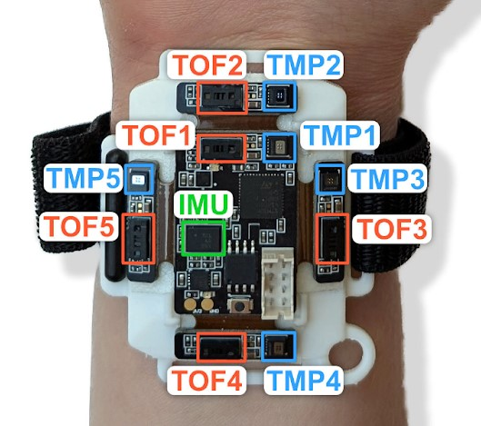
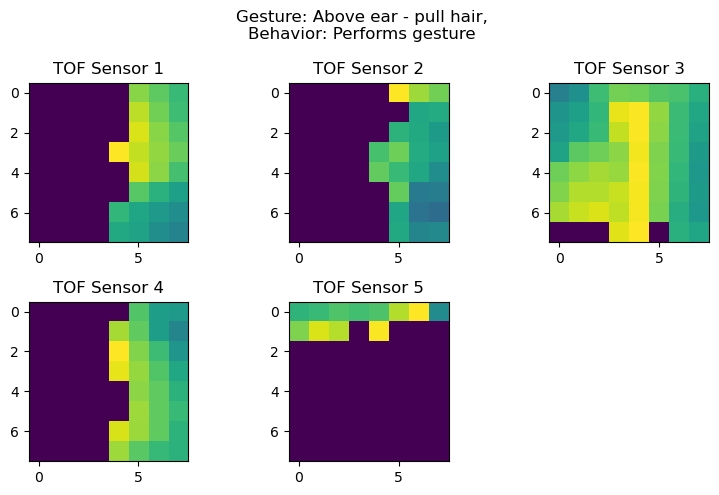
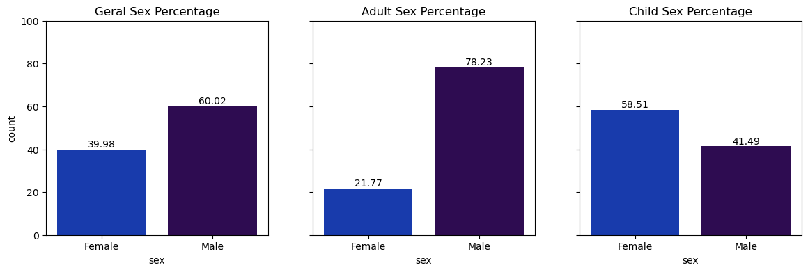

# Optimal Fertilizer Competition - Exploratory Analysis  

**Competition type**: ``Kaggle Playground`` 
**EDA Progress**: ``In Progress`` 
**Modeling**: ``Not Started`` 

Competition link: **[CMI - Detect Behavior With Sensor Data](https://www.kaggle.com/competitions/cmi-detect-behavior-with-sensor-data)**

## Objective
Develop a model to classify gestures as BFRB-like or not using wrist sensor data.  
Data includes IMU, thermopile (temperature), and time-of-flight (proximity) sensors.  
Evaluate with binary and macro F1 scores; test set includes IMU-only and full-sensor data.  

# Data Exploration 
The Sensors give to us 5 images each with a 1 color channel image with 8x8 pixels  

## Dataset Demographics Analysis

### First look into the sex distribution in the train data

- The predominant gender in the training data is **Male**, representing **60.02%** of the total.
  - When we split by age group:
    - Among **adults**, **78%** are male.
    - Among **children**, **58%** are **female**.

 

