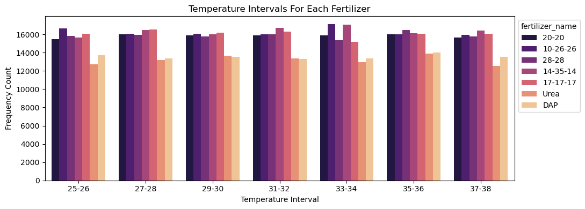

# Optimal Fertilizer Competition - Exploratory Analysis  

**Competition type**: <code style="color:lightblue">Kaggle Playground</code> 
**EDA Progress**: <code style="color:orange">In Progress</code> 
**Modeling**: <code style="color:red">Not Started</code>

### **Summary of tools**:
- Using **SQL** with <code style="color:yellow">duckdb</code> to a less verbose on filtering and grouping
- Plotting data with <code style="color:yellow">Matplotlib & Seaborn</code>
- To modeling i'll use <code style="color:yellow">XGBoost, Catboost, Sklearn</code> choosing the framework by best performance
- For model optimization i'll use the <code style="color:yellow">Optuna</code>
## Numerical Data Distribution

The **temperature** feature shows the most distinct periodic peaks, while **potassium** and **humidity** also exhibit periodic patterns, but with lower amplitude. In contrast, the other features display relatively uniform distributions with minor oscillations.
 
 

## Temperature Intervals for Each Fertilizer

In this graph, we can observe the results of each fertilizer across different temperature ranges.

- The fertilizer **"10-26-26"** shows greater variance in the temperature ranges of **25–26°C** and **33–34°C**. These variations may indicate how temperature, combined with other features, impacts the fertilizer's performance.

