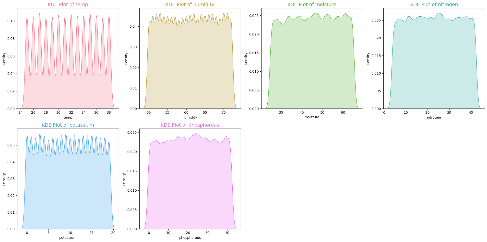

# Optimal Fertilizer Competition - Exploratory Analysis  

**Competition type**: ``Kaggle Playground`` 
**EDA Progress**: ``In Progress`` 
**Modeling**: ``Not Started``

### **Summary of tools**:
- Using **SQL** with ``duckdb`` to a less verbose on filtering and grouping
- Plotting data with ``Matplotlib`` and ``Seaborn``
- To modeling i'll use ``XGBoost, Catboost, Sklearn`` choosing the framework by best performance
- For model optimization i'll use the ``Optuna``

## Numerical Data Distribution

The **temperature** feature shows the most distinct periodic peaks, while **potassium** and **humidity** also exhibit periodic patterns, but with lower amplitude. In contrast, the other features display relatively uniform distributions with minor oscillations.
 
 

## Temperature Intervals for Each Fertilizer

In this graph, we can observe the results of each fertilizer across different temperature ranges.

- The fertilizer **"10-26-26"** shows greater variance in the temperature ranges of **25–26°C** and **33–34°C**. These variations may indicate how temperature, combined with other features, impacts the fertilizer's performance.

